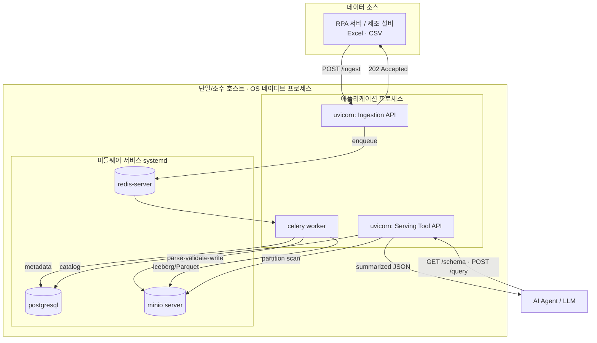

# RPA Data-to-AI 통합 시스템 — 기술 설계서 (Docker 미사용 · 네이티브 구동판)

| 항목 | 내용 |
|---|---|
| 문서 버전 | v1.1 (Native) |
| 대상 | 개발팀 / 제안 검토자 |
| 범위 | 정형 데이터 수집 파이프라인 + AI 에이전트 서빙 Tool API |
| 배포 환경 | On-premise, Air-gapped, **컨테이너 미사용 — OS 네이티브 프로세스/서비스로 구동** |

> v1.0 대비 변경점: 컨테이너(Docker/Compose)를 사용하지 않고, 미들웨어(PostgreSQL·Redis·MinIO)와 애플리케이션(FastAPI·Celery)을 **OS 서비스/실행 바이너리/systemd**로 직접 구동하는 방식으로 인프라·배포 섹션을 재작성했습니다. 아키텍처·데이터모델·기능 설계는 동일합니다.

---

## 1. 개요

### 1.1 목적
사내 RPA 시스템 및 제조 설비에서 발생하는 정형 데이터(Excel/CSV)를 안정적으로 통합 수집하고, 사내 AI 에이전트(LLM)가 보안 규칙을 준수하며 조회할 수 있는 **Data-to-AI 통로(`tool_api`)** 를 구축한다.

### 1.2 범위
- **In-scope**: 비동기 수집 API, 스토리지/카탈로그 레이어, 쿼리 엔진, 에이전트 전용 Tool API
- **Out-of-scope**: LLM 모델 자체, 에이전트 오케스트레이션 로직, RPA 봇 구현

### 1.3 제약 조건 (Hard Constraints)

| ID | 제약 | 영향 |
|---|---|---|
| C-1 | **Air-gapped**: 외부 인터넷·퍼블릭 클라우드 연동 불가, 사내 인프라 100% 독립 동작 | 매니지드 서비스 불가, 패키지/바이너리 오프라인 반입 |
| C-2 | **OSS only**: 100% 오픈소스(무료 라이선스)만 사용 | 라이선스 사전 검증 필수 |
| C-3 | **비동기 처리**: 대용량 파일 유입 시 타임아웃 방지 | 동기 블로킹 금지, Queue-Worker 패턴 강제 |
| C-4 | **컨테이너 미사용** | OS 패키지/바이너리 직접 설치, systemd 등 OS 수준 프로세스 관리 |

> 권장 스택은 표준안이며, C-1~C-4를 만족하는 전제 하에 운영 안정성·효율 우월 대안은 사유와 함께 변경 제안 가능.

---

## 2. 아키텍처

### 2.1 컴포넌트 다이어그램 (네이티브 프로세스 기준)



> 모든 컴포넌트가 동일 호스트(또는 소수의 호스트)에서 **포트 기반**으로 통신한다. 컨테이너 네트워크 대신 `localhost`/사내 IP + 포트를 사용한다.

### 2.2 설계 원칙
- **Write/Read 경로 분리**: 수집 부하와 조회 부하를 독립.
- **에이전트 격리**: LLM은 DB 직접 접근·임의 SQL·파일시스템 접근 불가. Pydantic 계약 Tool API만 경유.
- **컨텍스트 효율**: 서빙 결과는 요약·정제 JSON으로 반환하여 LLM context window 절약.

### 2.3 경로별 처리 흐름

**Write Path**
```
RPA → POST /ingest → 202 Accepted(즉시) → Redis enqueue
    → Celery Worker: parse → validate(Pydantic) → Parquet 변환
    → MinIO write(Iceberg 파티션) → PostgreSQL 카탈로그/이력 기록
```

**Read Path**
```
Agent → GET /schema / POST /query(인자값)
    → Pydantic 검증 → 파티션 프루닝 스캔(MinIO) → DuckDB 집계 → 요약 JSON
```

---

## 3. 기술 스택 및 선정 근거

| 레이어 | 기술 | 네이티브 구동 형태 | 선정 근거 / 대안 |
|---|---|---|---|
| API | **FastAPI + Uvicorn** | `uvicorn` 프로세스(systemd) | native async, 자동 OpenAPI. 대안: Litestar |
| Validation | **Pydantic v2** | 라이브러리 | 입력 화이트리스트로 에이전트 격리 |
| Broker | **Redis** | `redis-server` (systemd/바이너리) | 경량 브로커. 대안: RabbitMQ |
| Worker | **Celery** | `celery worker` 프로세스(systemd) | 성숙한 재시도/스케줄링. 대안: Dramatiq |
| Object Storage | **MinIO** | `minio server` 단일 바이너리 | 폐쇄망 S3 대체, 단일 정적 바이너리로 설치 간단 |
| Table Format | **Apache Iceberg / PyIceberg** | 라이브러리 | ACID·스키마 진화·스냅샷. 대안: Delta Lake |
| File Format | **Parquet** | 라이브러리 | predicate/projection pushdown |
| Catalog | **PostgreSQL** | OS 서비스(systemd) | Iceberg SQL 카탈로그 백엔드 겸용 |
| Query Engine | **DuckDB** | in-process 라이브러리(별도 서버 없음) | Parquet/Arrow 고속 분석, 데몬 불필요 |
| Vector DB | **Milvus** | (선택) standalone 프로세스 | 유사도 검색(RAG). 정형 조회와 역할 분리 |

> **DuckDB는 서버가 없다**: 애플리케이션 프로세스에 내장(in-process)되어 동작하므로, 컨테이너 미사용 환경에서 추가 데몬 관리 부담이 없다 — 네이티브 구동에 특히 유리한 선택.

---

## 4. 기능 요구사항 설계

### 4.1 REQ-01 — 비동기 원천 데이터 수집 (Ingestion)

| 항목 | 값 |
|---|---|
| Method / Path | `POST /ingest` |
| 요청 | `multipart/form-data` (file) + source_id |
| 응답 | `202 Accepted` + `{ task_id, status }` |
| 처리 모델 | 즉시 응답 후 Celery 워커가 백그라운드 처리 |

**설계 고려사항**
- **멱등성**: `content hash`로 동일 파일 중복 적재 방지.
- **재시도**: `acks_late=True` + `max_retries`로 워커 장애 시 유실 방지.
- **백프레셔**: 큐 길이 모니터링, 워커 동시성(`--concurrency`) 조정.
- **DLQ**: 파싱 실패 건은 dead-letter 버킷으로 격리.

### 4.2 REQ-02 — AI 에이전트 서빙 Tool API

> **보안 철칙**: 에이전트는 DB 직접 SQL·파일시스템 접근 **금지**. Pydantic으로 엄격히 정의된 Tool API만 허용.

- **`GET /agent/tools/schema`**: 현재 카탈로그의 컬럼/메타데이터를 JSON Schema로 반환. 신규 컬럼 추가 시 자동 반영.
- **`POST /agent/tools/query`**: 자연어가 아닌 계약된 인자값(`{"production_date":"2026-05-29","line_id":"FAB-1"}`)으로 호출. 파티션 프루닝 후 요약 JSON 반환.

**설계 고려사항**: 임의 SQL 차단(화이트리스트 인자), 파티션 직행, 응답 정제(토큰 절약).

---

## 5. 스토리지 & 데이터 모델

### 5.1 MinIO 버킷 레이아웃
```
raw/         # 원본 파일(감사·재처리 보존)
staging/     # 수집 직후 임시
warehouse/   # Iceberg 테이블 데이터(Parquet) + 메타데이터
dlq/         # 파싱 실패 격리
```
> 네이티브 MinIO의 데이터 루트는 OS 디렉터리(예: `/srv/minio/data`)이며, 위 버킷은 그 하위에 생성된다.

### 5.2 Iceberg 파티셔닝 전략
```
warehouse/<dataset>/
  data/ production_date=2026-05-29/ line_id=FAB-1/ *.parquet
  metadata/ ...
```
- 파티션 키: `production_date`(일) + `line_id`.
- 스키마 진화: 신규 컬럼은 Iceberg `add column`으로 무중단 반영.

### 5.3 PostgreSQL 역할
1. **Iceberg SQL 카탈로그 백엔드** (PyIceberg가 자동 관리하는 테이블)
2. **적재 이력(audit) 테이블** `ingestions(task_id, dataset, source_id, content_hash, rows, status, ...)`

---

## 6. 배포 & 인프라 (Docker 미사용 · 네이티브)

### 6.1 호스트 구성
- 기준 OS: Linux (Ubuntu 22.04 LTS 등 사내 표준). Windows 개발 환경 병행 시 6.5 참고.
- 단일 호스트에 미들웨어 + 앱을 함께 두거나, 필요 시 미들웨어/앱 호스트를 분리(포트로 연결).

### 6.2 미들웨어 — OS 서비스/바이너리

| 컴포넌트 | 설치 형태 | 구동 | 포트 |
|---|---|---|---|
| PostgreSQL | OS 패키지(`apt`/RPM) | systemd 서비스 | 5432 |
| Redis | OS 패키지 또는 바이너리 | systemd 서비스 / 바이너리 | 6379 |
| MinIO | **단일 정적 바이너리** | systemd 서비스 / 바이너리 | 9000(API)·9001(콘솔) |

> DuckDB는 별도 설치/서비스가 없다(Python 패키지로 앱에 내장).

### 6.3 애플리케이션 프로세스 — systemd 권장

| 프로세스 | 실행 | 비고 |
|---|---|---|
| API | `uvicorn app.main:app` | 부팅 시 버킷/카탈로그/테이블 부트스트랩 |
| Worker | `celery -A app.workers.celery_app worker` | 비동기 적재 처리 |

운영에서는 두 프로세스를 **systemd 유닛**으로 등록해 자동 재시작·로그 관리(journald)를 적용한다(구체 유닛 파일은 구현 가이드 참조).

### 6.4 폐쇄망 반입 (C-1 + C-4)
컨테이너 이미지를 쓰지 않으므로 다음을 오프라인 반입한다.
1. **OS 패키지**: PostgreSQL/Redis 등 `.deb`(또는 RPM) + 의존성 (`apt-get download` / 로컬 미러)
2. **MinIO 바이너리**: 단일 실행 파일(인터넷망에서 사전 확보)
3. **Python 휠**: `pip download -r requirements.txt -d offline_packages`

### 6.5 환경 체크리스트
| 항목 | 권장 |
|---|---|
| OS | Linux(Ubuntu 22.04+) / 사내 표준 |
| Python | 3.11+ (venv) |
| 프로세스 관리 | systemd (Linux) — 자동 재시작·부팅 시 기동 |
| 데이터 디렉터리 | PostgreSQL·MinIO 데이터 경로의 디스크 용량·백업 |
| NTP | 사내 NTP로 시각 동기화 |
| TLS/CA | API·MinIO에 사내 인증서, 운영 시 MinIO `secure=true` |
| 자격증명 | 기본 비밀번호를 운영 값으로 교체 |
| 라이선스 | 전 컴포넌트 OSS 라이선스 검증 |

---

## 7. 보안 설계

| 영역 | 통제 |
|---|---|
| 에이전트 격리 | 임의 SQL/파일 접근 차단, Pydantic 화이트리스트 인자만 허용 |
| 인증/인가 | 수집·서빙 API 분리 인증(서비스 토큰/mTLS), 데이터셋 단위 권한 |
| 입력 검증 | 스키마·패턴·범위 검증(`limit` 상한)으로 인젝션·과다 조회 방지 |
| 감사 | 원본 보존(`raw/`), 적재/쿼리 로그 |
| 네트워크 | 폐쇄망 내부 통신만 허용, 외부 egress 차단, 미들웨어 포트는 내부 바인딩 |
| OS 보안 | 서비스별 전용 시스템 계정, 데이터 디렉터리 권한 최소화 |

---

## 8. 비기능 요구사항 (NFR)

| 분류 | 요구 / 지표 |
|---|---|
| 가용성 | 워커 다중 인스턴스(systemd 템플릿 유닛), Redis 영속화로 작업 유실 방지 |
| 성능 | 수집 즉시 202, 조회 파티션 프루닝 기반 저지연 |
| 확장성 | 워커 수평 확장(인스턴스 추가), 스토리지 용량 독립 확장 |
| 관측성 | API 메트릭, 큐 길이, 워커 처리량, 실패율(DLQ), journald 로그 |
| 운영성 | 재처리 경로, 스키마 진화 무중단 반영 |

---

## 9. 구축 마일스톤

| 단계 | 산출물 | 검증 기준 |
|---|---|---|
| M1 | 미들웨어 네이티브 기동(PostgreSQL/Redis/MinIO) | 포트 응답·헬스 확인 |
| M2 | Ingestion API + MinIO 적재 | 업로드→`raw/` 저장 확인 |
| M3 | Redis + Celery 비동기화 | 202 즉시 응답 + 백그라운드 적재 |
| M4 | Parquet/Iceberg + PostgreSQL 카탈로그 | 파티션 적재·메타 등록 |
| M5 | DuckDB 서빙 + Tool API 에이전트 연동 | 파티션 조회·격리 검증 |
| M6 | systemd 등록(자동 재시작/부팅 기동) | 재부팅 후 자동 복구 |
| M7 | (선택) Milvus 유사도 검색 | RAG 경로 추가 |

---

*본 문서는 「RPA 구축」 요구사항(REQ-01, REQ-02)을 기준으로 한 컨테이너 미사용(네이티브) 기술 설계서이며, 명시된 버전·구성은 표준 예시입니다. 도입 시 컴포넌트 안정 버전과 사내 보안 정책으로 확정하십시오.*
